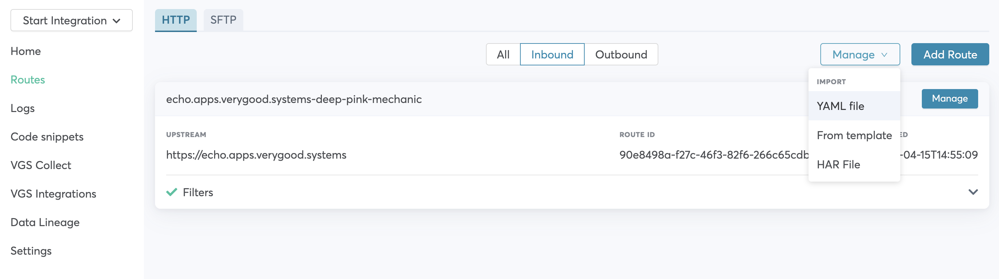

# SwiftUI sample with VGS Show/Collect iOS SDK

This examples shows how you can integrate VGS Collect/Show iOS SDKs into your SwiftUI application and secure sensitive data with us.

VGS Collect and Show iOS SDK are built upon UIKit, you can integrate VGS Collect and Show views
using [UIViewRepresentable](https://developer.apple.com/documentation/swiftui/uiviewrepresentable) wrappers into your SwiftUI code.   
Check more official [Apple tutorials](https://developer.apple.com/tutorials/swiftui/interfacing-with-uikit) how to adapt UIKit views for SwiftUI.

> **_NOTE:_**  This demo is just an example of how UIKit views from VGS Collect/Show SDKs can be integrated into your SwiftUI application. VGS doesn't have official SwiftUI support yet.

<p align="center">
		    
		    
</p>

## How to run it?

### Requirements

- [Xcode](https://developer.apple.com/xcode/) 
- Install <a href="https://cocoapods.org/" target="_blank">Cocoapods</a> for running iOS
- Organization with <a href="https://www.verygoodsecurity.com/">VGS</a>

#### Step 1

Go to your <a href="https://dashboard.verygoodsecurity.com/" target="_blank">VGS organization</a> and establish <a href="https://www.verygoodsecurity.com/docs/getting-started/quick-integration#securing-inbound-connection" target="_blank">Inbound connection</a>. For this demo you can import pre-built route configuration:

<p align="center">

</p>

-  Find the **configuration.yaml** file inside the app repository and download it.
-  Go to the **Routes** section on the <a href="https://dashboard.verygoodsecurity.com/" target="_blank">Dashboard</a> page and select the **Inbound** tab. 
-  Press **Manage** button at the right corner and select **Import YAML file**.
-  Choose **configuration.yaml** file that you just downloaded and tap on **Save** button to save the route.

#### Step 2

Clone demo application repository.

`git clone git@github.com:vgs-samples/vgs-collect-show-ios-swiftUI-demo.git`

#### Step 3

Setup `"<VAULT_ID>"`.

Find `DemoAppConfig.swift` in app and replace `vaultId` constant with your <a href="https://www.verygoodsecurity.com/docs/terminology/nomenclature#vault" target="_blank">vault id</a>.

#### Step 4

Before running iOS project `cd` to the sample project directory and and run:

```ruby
pod update
```

Use `workspace` file and run the demo.

> **_NOTE:_**  CardIO and CardScan support only iOS platform, scanners cannot be used in macOS app even it is built with SwiftUI.

#### Step 5

Submit and reveal the form then go to the Logs tab on a Dashboard find a request and secure a payload.
Instruction for this step you can find <a href="https://www.verygoodsecurity.com/docs/getting-started/quick-integration#securing-inbound-connection" target="_blank">here</a>.
